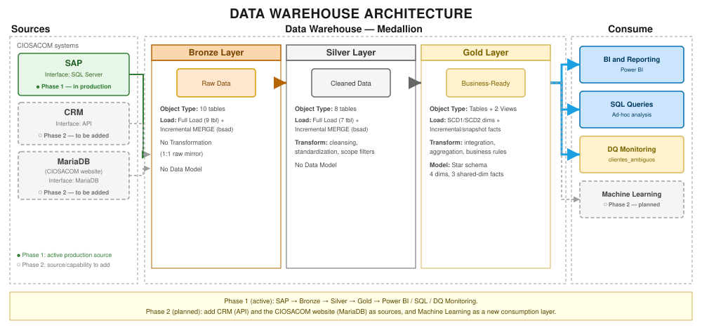

# Accounts Receivable Medallion Data Warehouse

Enterprise Data Warehouse built on SQL Server (T-SQL) using a **Medallion Architecture** (Bronze → Silver → Gold) to pipeline, cleanse, and model SAP ECC data (FI/SD modules) for Accounts Receivable / Credit & Collections analytics.

## Architecture

```
SAP ECC (linked server)
    │  raw mirror, no transformations
    ▼
BRONZE  ── 10 tables, customer master + AR line items
    │  cleansing, standardization, business-scope filters
    ▼
SILVER  ── 8 tables, one bronze table → one silver table
    │  integration, star schema, business logic
    ▼
GOLD    ── dimensions (SCD1/SCD2) + facts + reporting views
    │
    ├──► DQ  ── ongoing data-quality monitors
    └──► Power BI
```

Each layer is loaded by its own stored procedure (`bronze.load_bronze`, `silver.load_silver`, `gold.load_gold`, `dq.load_clientes_ambiguos`), run in that order. `gold.load_gold` is a thin orchestrator that chains the individual gold load procedures — each of those still runs standalone for isolated testing.



*Editable source: [docs/architecture/architecture_dwh.drawio](docs/architecture/architecture_dwh.drawio).*

### Data sources & roadmap

This warehouse is being rolled out in phases:

- **Phase 1 (current, in production)** — SAP ECC (FI/SD modules), pulled via a SQL Server linked server. This is the only source feeding Bronze/Silver/Gold today.
- **Phase 2 (planned)** — two additional CIOSACOM systems will be centralized into the same Medallion pipeline: the **CIOSACOM website's MariaDB database** and the **CRM**. Neither is connected yet; onboarding either will follow the same Bronze (raw mirror) → Silver (cleansing/standardization) → Gold (star schema) pattern already proven for SAP.

## Repository structure

```
docs/
├── architecture/
│   ├── architecture_dwh.svg          rendered architecture diagram (used in this README)
│   ├── architecture_dwh.drawio       editable source (diagrams.net / draw.io)
│   ├── physical_data_model.drawio    physical data model
│   └── fase0_preguntas.md            business questions the model has to answer
└── archive/
    └── fact_aplicacion_v2_retirado.md  record of a retired design and the evidence behind it
dwh_architecture/
├── init_database.sql        schema creation (bronze/silver/gold/control/dq)
├── inventario_objetos.sql   catalog query to compare the server against the repo
├── 01_bronze/
│   ├── ddl_bronze.sql             raw tables, 1:1 mirror of SAP source fields
│   ├── sp_load_bronze.sql         daily load (truncate+insert, incremental merge for high-volume tables)
│   ├── sp_backfill_bsad.sql       historical backfill, year by year (empty server / recovery)
│   ├── sp_backfill_bkpf.sql       historical backfill of document headers (DZ)
│   ├── sp_backfill_bsas.sql       historical backfill of cleared bank lines
│   ├── sp_recargar_bsis.sql       full reload of open bank lines (recovery, not daily)
│   └── generar_ddl_desde_p01.sql  builds a bronze CREATE TABLE from the source catalog
├── 02_silver/
│   ├── ddl_silver.sql                   cleaned/standardized tables
│   ├── sp_load_silver.sql               daily load (type casting, null handling, scope filters)
│   ├── backfill_bsad_historico.sql      historical backfill, year by year
│   ├── backfill_bkpf_historico.sql      historical backfill of document headers
│   └── backfill_bsas_bsis_historico.sql historical backfill of bank lines
├── 03_gold/
│   ├── ddl_gold.sql                     star schema: dimensions + facts
│   ├── dim_festivo.sql                  hand-maintained holiday calendar (run before the first gold load)
│   ├── ddl_dim_presupuesto.sql          conformed dimensions for the collections budget
│   ├── sp_load_gold.sql                 load procedures (SCD1/SCD2, incremental) + orchestrator
│   ├── vw_pago_factura_simple.sql       payment-to-invoice reconciliation view (legacy report)
│   ├── vw_cartera_abierta.sql           open invoices, line by line
│   ├── vw_cobranza_diaria.sql           actual collections per day
│   ├── backfill_fact_aplicacion_pagos.sql            historical backfill of the payment-application model
│   └── backfill_fact_pagos_facturas_compensados.sql  historical backfill of the legacy settled facts
├── 04_dq/
│   ├── ddl_dq.sql                          data-quality flag tables
│   ├── sp_load_dq.sql                      data-quality monitor load
│   └── validate_clasificacion_cobranza.sql  ad-hoc query re-validating vw_pago_factura_simple's month-cohort classification on demand
└── 04_pronostico/
    ├── ddl_presupuesto.sql        collections budget tables
    ├── modelo_presupuesto.sql     the budget model and its out-of-sample validation
    ├── sp_load_presupuesto.sql    monthly budget load (run once a month, not daily)
    ├── desglose_cobranza_mes.sql  what a month's collections are made of
    └── demostrar_desglose.sql     one query per objection to that breakdown
```

One-time migrations (ALTER, rename, drop) are removed once their change is folded into the `ddl_*.sql` files; they stay in git history.

## Data model

**Bronze** — raw mirror of 10 SAP tables (customer master, sales/credit views, open and cleared AR line items, plus lookup tables for route names and employee names).

**Silver** — 8 cleansed tables. `mandante`/organization-code scoping, null normalization, and leading-zero stripping happen here; cross-entity joins are deliberately kept out (silver stays one-bronze-table-to-one-silver-table).

**Gold** — star schema:
- `dim_fecha` — calendar dimension, self-extending (lower bound fixed at 2022-01-01, upper bound rolls forward to today+1 year on every load).
- `dim_cliente` — customer identity, **SCD Type 1**.
- `dim_cliente_comercial` / `dim_cliente_credito` — commercial and credit attributes, **SCD Type 2** (hash-based change detection, temporal joins from facts).
- `fact_pagos_compensados` / `fact_facturas_compensadas` — incrementally-merged mirrors of customer payments and invoices.
- `fact_saldo_cartera` — daily periodic-snapshot fact of open AR balance and aging, plus rolling payment-behavior metrics (days-to-pay, % on-time).
- `vw_cliente_canal_estatus` / `vw_pago_factura_simple` — business-rule views: customer commercial status classification, and payment-to-invoice reconciliation (SAP settles payments and invoices as compensation groups, not a native 1:1 relationship — this view reconstructs that relationship for groups that can be resolved unambiguously). The reconciliation view also classifies each settled invoice as overdue, due-this-month, or paid-early (`clasificacion_cobranza`), the basis for the customer payment-behavior reporting built on this model.

**DQ** — standalone monitors (e.g. customers flagged with more than one simultaneously-active commercial channel) that don't block the gold load, just surface data issues upstream in SAP.

See [DESIGN.md](DESIGN.md) for the full reasoning behind every table/view — why each dimension is shaped the way it is, when a table vs. a view was the right call, and what got tried and retired along the way.

## Engineering notes

- **Incremental loads**: high-volume tables (`sap_bsad`, `fact_pagos_compensados`, `fact_facturas_compensadas`) use `MERGE` scoped to a rolling current+previous-month window, with one-time backfill scripts kept separate from the daily incremental procedures.
- **SCD Type 2** implemented as explicit sequential steps (stage → close changed versions → insert new versions) rather than a single `MERGE`, for straightforward debugging on the target SQL Server version.
- **Data-quality safeguards baked into the model**: ambiguous-customer detection, and a same-RFC safeguard that prevents a payment from being attributed to another company's invoices when SAP batches unrelated settlements into the same compensation group.
- Built and tested against **SQL Server 2012 SP1**, which constrains several patterns (no `CREATE OR ALTER`, limited transaction log headroom on large loads, etc.) — load procedures are written accordingly.

## Known limitations

- **SCD Type 2 history is only reliable from when each dimension's load procedure started running regularly.** A customer's first-ever captured version is backdated so older facts can still join to it, but that's a join-compatibility mechanism, not a claim that the attribute was actually true that far back — classifications that depend on projecting a *current* SCD2 attribute onto old transactions should be treated with that in mind.
- **`fact_saldo_cartera` cannot be backfilled.** Its source (`silver.sap_bsid`) is a full daily mirror with no history retained, so the snapshot fact only accumulates forward from the day its load started running.
- **Payment-to-invoice matching is deliberately incomplete.** `vw_pago_factura_simple` only resolves settlement groups with exactly one payment candidate and a single real company involved; ambiguous groups are left unmatched rather than guessed.
- **`clasificacion_cobranza` classifies by calendar month, not exact days.** An invoice due the 1st of a month, paid the last day of the prior month, counts as early by one day but lands in the same bucket as a payment made weeks ahead. Quantified against real data and found immaterial (each direction of the effect is under 4% of its bucket's amount) — see [DESIGN.md](DESIGN.md) for the validation.

## Status

Bronze, Silver, and Gold layers are stable and reconciled against independent external reports. A Power BI report on top of this model is published in a separate public repository, [comportamiento-pago-credito](https://github.com/romloc11/comportamiento-pago-credito) — that copy runs on embedded sample data rather than a live connection to this warehouse, built specifically for portfolio use.
